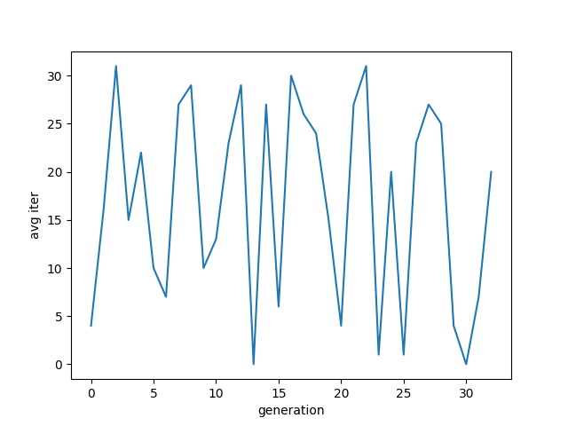

## 最初目标

找到一种优化算法， 能够优化ymx师兄给出的类似于知识蒸馏的一个模型

模型主要包含
1. 元采样网络
2. 信源知识库
3. 虚拟信宿知识库

 

 

元采样网络为某种分布转化器, 知识库为某种生成模型. 信源知识库按照元采样网络的"指示"生成数据, 虚拟信宿知识库接受信源生成的数据并进行训练, 训练完成后生成一批验证数据, 交由信源知识库进行检验, 优化目标是“使得虚拟信宿生成数据能够通过检验的训练迭代次数最小”， 参数为元采样网络

优化过程中仅有的参数是元采样网络，元采样网络直接决定了信源知识库的生成数据分布，参数改变的也只是虚拟新宿知识库所接受的训练数据的分布

## 训练数据的分布情况如何影响训练的迭代次数

什么是训练数据的分布情况：训练数据在各个类别中的分布，比如有10000张图片，如果有10个类别,均匀分布即表示每个类的图片数量是相等的，即每个类有1000张。这里完全不考虑像素值本身的分布以及像素联合分布，类别分布最简单

一个已经在ABC类上训练好的生成模型，现在要迁移到ABCDEF类上去，提供分布偏向DEF的数据能否使得训练时间缩短，要求生成图片质量必须达到一定标准

在训练过程中，改变哪怕一张图片，训练过程就会受到影响，但是提供有偏向的数据分布，从结果看，并不能提高训练速度

 

 
